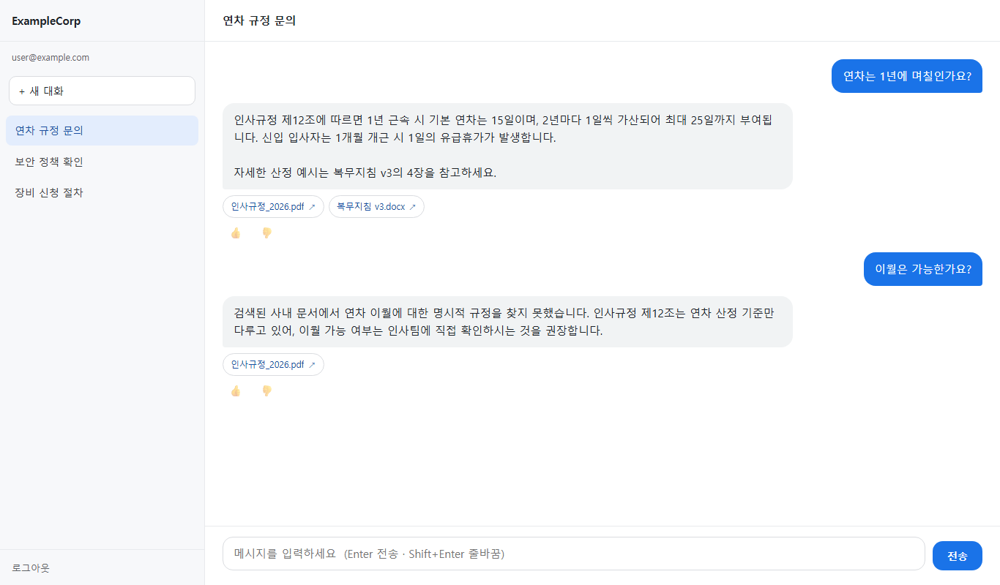
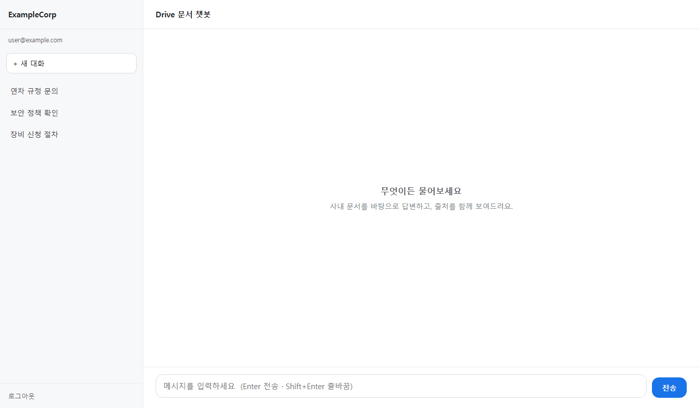

# Drive Chatbot — 사내 문서 RAG 챗봇


사내 Google Drive / GCS 문서를 검색해, **문서 근거에 한정해 답변하는** RAG 챗봇입니다.
"그럴듯한 답"이 아니라 "근거 있는 답"을 목표로, 검색→재정렬→생성→검증 4단계 파이프라인으로 설계했습니다.

> **상태**: Cloud Run 배포 완료 · 운영 고도화 진행 중
> (에러 핸들링·알림 체계 구축 중 → 이후 골든셋 기반 품질 평가, BigQuery 분석 파이프라인 예정. [로드맵](#로드맵) 참고)

---

## 스크린샷

> 아래 그림은 **가상 데이터**로 렌더링한 화면입니다 (실제 사내 문서·계정 없음).



*답변마다 근거 문서(출처 칩)를 함께 표시하고, 문서에서 근거를 찾지 못하면 지어내지 않고 그렇게 답합니다. 👍/👎 피드백은 Firestore 에 기록됩니다.*



## 아키텍처

```
사용자 질문
   │
   ▼
[1. 검색]  하이브리드 데이터소스
   │        · 공용 문서: GCS + Vertex AI Search
   │        · 개인 문서: Google Drive (OAuth 2.0)
   ▼
[2. 재정렬]  Re-ranking — 검색 결과를 질문 관련도 순으로 재정렬
   ▼
[3. 생성]  Gemini — 재정렬된 문서 근거로만 답변 생성
   ▼
[4. 검증]  답변 검증 레이어 — 근거 문서와 대조해 환각 여부 점검
   │
   ▼
답변 + 근거 문서 출처

대화 로그 ──▶ Firestore(실시간 저장) ──▶ BigQuery(분석, 예정)
```

## 주요 특징

- **4단계 RAG 파이프라인** — 검색·재정렬·생성·검증을 분리해, 각 단계를 독립적으로 교체·개선 가능
- **하이브리드 검색** — 공용 문서(GCS + Vertex AI Search)와 개인 문서(OAuth Drive)를 함께 검색
- **검색 백엔드 추상화** — 검색 구현을 인터페이스 뒤로 분리, 설정 변경만으로 백엔드 교체
- **환각 방지** — 답변을 문서 근거에 한정 + 생성 후 검증 레이어로 이중 점검
- **API 보호** — Rate Limit + 사용량 미터링으로 비용·남용 통제
- **화이트라벨 UI** — 회사명·프롬프트·모델을 `.env`로 관리, 코드 수정 없이 재배포 가능
- **설계 결정 문서화** — 주요 아키텍처 결정을 ADR로 기록 ([docs/adr/](docs/adr/README.md))

## 보안·운영

| 항목 | 적용 내용 |
|---|---|
| 접근 제어 | Cloud Run 앞단에 **IAP**(Identity-Aware Proxy) — 허용된 계정만 접근 |
| 비밀 관리 | API 키·자격증명은 **Secret Manager**로 분리, 코드·이미지에 미포함 |
| 인증 | Google OAuth 2.0 — 관리자 권한 없이 개인 인증 방식 |
| 비용 통제 | GCP 프로젝트 분리 + 예산 알림 가드레일, API Rate Limit·사용량 미터링 |
| 안정성 | 에러 핸들링·장애 알림 체계 구축 중 (진행 중) |

## 기술 스택

| 영역 | 선택 | 이유 |
|---|---|---|
| Backend | FastAPI + Uvicorn (Python 3.11, async) | 비동기 I/O, 자동 API 문서 |
| 검색 | Vertex AI Search + OAuth Drive (추상화) | 백엔드 교체를 설정 한 줄로 |
| 생성 | Gemini Flash (RAG) | 비용/지연 균형, 모델명은 `.env`로 관리 |
| 인증 | Google OAuth 2.0 + IAP | 개인 인증 + 배포 환경 접근 제어 |
| DB | Firestore(실시간) + BigQuery(분석) | 대화 저장 / 분석 워크로드 분리 |
| 배포 | Docker + Cloud Run + Secret Manager | 서버리스, 사용량 기반, 비밀 분리 |

## 설계 결정 (ADR)

주요 아키텍처 결정은 [docs/adr/](docs/adr/README.md)에 문서화했습니다. 대표 예:

- 하이브리드 데이터소스 구성 — 공용 검색과 개인 문서 검색을 분리한 이유
- 청킹·임베딩 전략 — 문서 분할 단위와 검색 품질의 트레이드오프
- Firestore + BigQuery 이원화 — 실시간 저장과 분석 워크로드를 분리한 이유

## 테스트 · 코드 품질

```powershell
pytest            # 비동기 테스트 (asyncio_mode=auto, 가짜 검색 백엔드로 파이프라인 검증)
ruff check .      # 린트 — pyflakes/pycodestyle + isort + pyupgrade + bugbear + async 검사
mypy app          # 정적 타입 검사 — disallow_untyped_defs, pydantic 플러그인
black .           # 포매팅
```

- **검색 백엔드를 인터페이스로 추상화**했기 때문에, 테스트에서는 가짜(fake) 백엔드를 주입해
  외부 GCP 의존 없이 검색·권한 필터링 로직을 검증합니다 (`tests/conftest.py`)
- `mypy` 는 앱 전역에 **함수 시그니처 타입 강제**(`disallow_untyped_defs`) — Google 클라이언트
  라이브러리처럼 스텁이 불완전한 모듈만 명시적으로 예외 처리

## 로컬 실행

```powershell
Copy-Item .env.example .env   # 값 채우기
uvicorn app.main:app --reload --port 8000
```

- http://localhost:8000 — 상태 확인
- http://localhost:8000/health — 헬스 체크

## 로드맵

- [x] 하이브리드 검색 + 검색 백엔드 추상화
- [x] OAuth 로그인, Firestore 스키마 + 비동기 DB 연결
- [x] 4단계 RAG 파이프라인 (검색→재정렬→생성→검증)
- [x] API 엔드포인트 + Rate Limit + 사용량 미터링
- [x] 화이트라벨 UI + 사용자 피드백 수집
- [x] Docker 패키징 + Secret Manager
- [x] Cloud Run 배포 + IAP + 커스텀 도메인
- [ ] 에러 핸들링 + 장애 알림 **(진행 중)**
- [ ] 골든셋 기반 RAG 품질 평가 — 답변 정확도를 수치로 측정·개선
- [ ] BigQuery 분석 파이프라인 + 자동 리포트
- [ ] dbt 데이터 마트
- [ ] Terraform 모듈화 (IaC)
